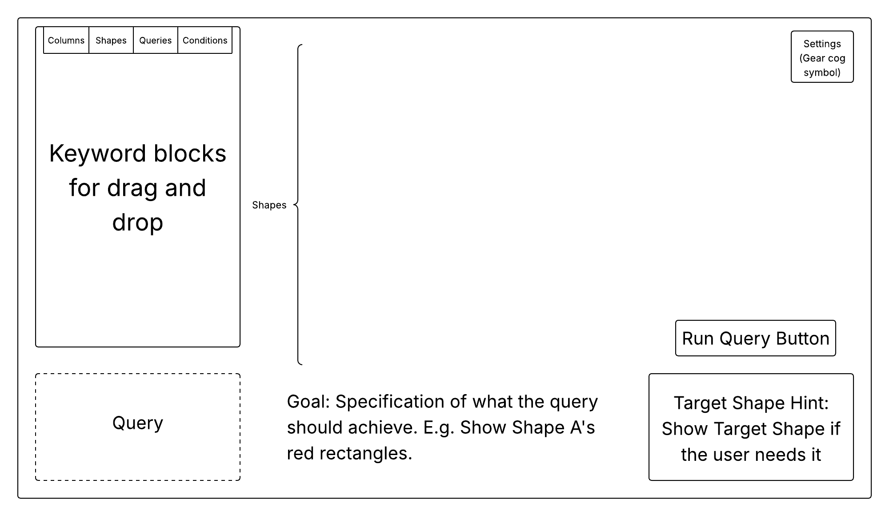

# Design of Game

## Developing the Idea

With the initial idea of the game set out, the next step is to develop the idea into something concrete that can work as a foundation to work on and experiment with until it reaches a playable state.

## The Core Ideas applied to SQL

### Analogy

Creating a game that teaches people SQL without ever coming near tables and databases might sound difficult, but even complicated things like databases can be simplified to a bunch of grids or shapes. In this case, the analogy I came up with for databases is that of shapes. Rather than thinking of the tables' grids as arrays or collections of information, they can be more simply understood as a set of rectangles stacked in a neat grid, with queries being the rearranging of those rectangles to create some target shape. To that end, a very abstract way to represent different columns is to colour all columns differently and to only refer to them by their color. E.g. rather than requesting "the column that contains the EmployeeIDs", the analogous request would be for "the red rectangles", which is notably much more abstract and simpler to understand. Continuing the analogy, different tables are different sets of rectangles, aka different separated "shapes". E.g. 2 tables could instead be referred to as "shape A" and "shape B". This approach allows us to abstract even the contents of the tables during the sections of the game focused on teaching `SELECT` and `FROM` commands, where the data entries of the tables are irrelevant. In SQLite, there are 5 data types, `NULL`, `INT`, `REAL`, `TEXT` and `BLOB`. Of these, only `NULL`, `INT` and `TEXT` are actually important to represent, as `REAL` is an extension of `INT` that isn't too important in the grand scheme of things, and `BLOB` is too wide of a category to consider representing. For `NULL`, the solution is as simple as not having anything in the rectangles or showing them as "transparent" to indicate the lack of contents. For `INT`, the numbers can be represented by having a certain number of circle marks in the rectangle (though this can present an issue with the differentiation of `NULL` and 0). Lastly, `TEXT` can be represented by putting a "label" on the rectangle, where the label is the text content. When searching for records where a column has the text 'dog', you search for the rectangles where "the label is 'dog'". The reason for taking this approach, aside from the reasons stated in the initial idea document is that this idea can be largely understood without lengthy tutorials and can extend beyond language barriers much easier. This ensures that the player learns logic, not syntax. `INSERT`ing records is simply adding rectangle rows into the shapes. The only problematic command in this analogy is the `DROP` command, as it can be used to represent sometimes completely unrelated ranges of commands, from dropping columns or tables, to removing constraints on certain fields. Nonetheless, for its basic usage of deleting tables, it can be abstracted as "deleting shapes". `JOIN` commands can be represented as the "merging together" of the two shapes to create a new compound shape. The primary and foreign key columns can be represented by having a highlighted outline around the column in for example yellow for the primary key and purple for the foreign key. The keys themselves might even get a different representation of nums to make them truly distinct, such as showing actual numerals to represent their IDs.

### Visualisation

The visualisation aspect of the game is also really important. Visualising the `SELECT` command by using various animation techniques, such as shrinking and turning down the opacity of rectangles that do not fit the criteria, then making them disappear to make way for the final result can help the player to understand what the command actually applies unto the table. Little UI design elements can gradually stack up to make a brilliant user experience where the use of SQL becomes second nature to imagine. Another example is when using the `ORDER BY` command, where the rearranging of the rectangles based on a field's contents is shown happening rather than just instantly snapping the rectangles into place helps the action sink in. This is most important with regards to the `JOIN` command, where a literal line can and should be drawn between the foreign key and its original record, with the process of the tables merging actively being animated. These might sound like trivial features to put a spotlight on, but the ability to visualise your actions is extremely important when dealing with complex queries. Even the filtering of `TEXT` fields using the `LIKE` keyword can be visualised by highlighting the common text of the records with the query.

### Distraction through Context

The last core idea that is important to the design of this game is to ensure it feels like "an actual game" (at least initially), rather than something made purely for educational value. While subjective, the main way this can be achieved is if it fits into a preexisting genre of video games and is designed to fit the genre first, with the "peeling back" of layers and educational aspects being considered secondary. The idea is that if the game does not depend on having the educational content, it is more likely to feel like a real game. The puzzle genre is obviously the best fit for this (especially given the fact that at times during class I'd try to imagine SQL exercises as puzzles / challenges to make it more fun). Framing the game as a logic puzzle makes it more entertaining. The puzzle games developed by Zachtronics are the staple titles in this approach, as they are entertaining and educational in equal parts. Thus, the puzzle design could be split into levels of one query each, where a different aspect of querying is covered, with occasional levels being "challenge levels" that simply try to make more difficult queries of the now understood content. The "peeling back" can be achieved if, for example, after a certain threshold of levels is beaten, the only way to advance to the next set / category (if the levels can be easily categorised without mentioning SQL) is to beat those levels using SQL. Though teaching the players SQL in the game would be ideal, that would take quite long, so it is much more likely that in its current form, the game will simply direct them to open resources to research the concepts needed to complete a level. When revealing the SQL aspect of a level, the actual SQLite table structure should be revealed to the player, along with ideally a small scale IDE that offers autocomplete trivial parts of the queries, like names of tables, their columns etc. This ensures that the player can not only consistently beat the levels they beat, but understands what their SQL query does in the context of the shapes, making for a unique learning experience. There should also be an "advanced/educational mode" option to skip the first step and begin with the SQL, which saves more knowledgeable players the time assuming they know SQL and a "casual mode" option that doesn't require the user to use SQL in the game, simply unlocking sets of levels as they go.

## The Query Method

The one thing that becomes a major topic of importance following the discussion of distraction through context is the non-SQL querying system for the game. This must be simple to use and intuitive. For that reason, a visual scripting system akin to Scratch is a better fit for ease of use than a query language that the user has to learn the syntax for. This aftewards becomes combined with SQL in the "peeling back" section of gameplay, which makes for a low-code solution, where code is not initially used when covering the logic but gradually introduced as the player learns to think in SQL. In fact, due to the structure of SQL, it doesn't even technically require Scratch levels of complexity, as SQL is a declarative language. For the visual scripting solution in the game, information can easily be dragged and dropped from a separate menu (or possibly from the entities themselves) into their queries using "keyword blocks" which are made from the set of information of what entities are available to interact with. Certain keywords like `SELECT` and `FROM` will likely be replaced with more fitting alternatives to the analogy of shapes, such as `SHOW` and `OF`, e.g. `SHOW Red OF Shape A`. There should obviously be options to undo and redo drag and drop actions.

## Visual Identity

The visual identity of the game isn't as important as the other aspects, but a relaxed and casual environment is ideal, so I am planning to go for a bubbly, vibrant and smooth aesthetic. Particular inspirations include Hue and Cult of the Lamb.

## Music

The music aesthetics of the game will also be inspired by that of Hue and Cult of the Lamb, potentially also including LoFi Hip-Hop. The music should help the players to enter a flow state and focus rather than distract them. It is meant to be felt, not heard.

## Level Progression

For the content I set out as crucial, I believe the following succession would be the ideal level progression, with each set containing probably around 5 levels each.

Level Sets:

- 1: `SELECT` (`*` and columns) and `FROM`
- 2: `WHERE` (`INT`)
- 3: `WHERE` (`TEXT`, `LIKE`)
- 4: `WHERE` (`NULL`, Multiple conditions using `AND`, `OR`, (`NOT`??))
- 5: ORDER BY, SELECT DISTINCT, SELECT LIMIT
- 6: Primary keys and DELETE
- 7: INSERT (and UPDATE??)
- 7: Foreign Keys and JOIN
- 8: DROP (can be used as punchline)

## Design Diagrams

